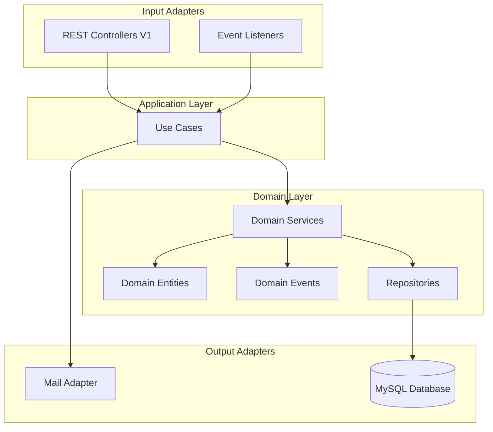

# Ad-Account Management System Design Document

## Overview

The Ad-Account Management System will extend the existing `adaccount` module to provide comprehensive account management capabilities including multi-user access control, budget management, hierarchical organization, and audit tracking. The design leverages the established domain-driven design patterns, hexagonal architecture, and event-driven communication already present in the codebase.

## Code Reuse Analysis

### Existing Components to Leverage

1. **Base Entities**: `BaseEntity` and `UpdatableEntity` for audit tracking
2. **Authentication**: JWT-based OAuth2 resource server with `JwtAuthenticationToken`
3. **Event System**: Spring Modulith's `@Externalized` events with configured routing
4. **Repository Pattern**: Spring Data JDBC with `CrudRepository`
5. **Use Case Pattern**: Transactional orchestration with `operator fun invoke()`
6. **Testing Infrastructure**: `IntegrationTestSpec` and `AcceptanceTestSpec`
7. **Value Objects**: Kotlin inline value classes for type-safe IDs
8. **Mail Port**: Existing `MailPort` interface for sending invitations

### New Components to Build

1. **Domain Entities**: `AdAccount`, `AdAccountMember`, `AdAccountBudget`
2. **Value Objects**: `AdAccountId`, `MemberRole`, `AccountStatus`, `BudgetType`
3. **Domain Services**: Account creation, member management, budget operations
4. **Use Cases**: Orchestration layer for each major operation
5. **REST Controllers**: Versioned endpoints following V1 pattern
6. **Domain Events**: Account lifecycle and member management events
7. **Database Tables**: Schema for new entities with proper relationships

## Architecture

### System Architecture Diagram



### Package Structure

```
adaccount/
├── domain/
│   ├── entity/
│   │   ├── AdAccount.kt
│   │   ├── AdAccountMember.kt
│   │   └── AdAccountBudget.kt
│   ├── vo/
│   │   ├── AdAccountId.kt
│   │   ├── MemberRole.kt
│   │   ├── AccountStatus.kt
│   │   └── BudgetType.kt
│   ├── repository/
│   │   ├── AdAccountRepository.kt
│   │   ├── AdAccountMemberRepository.kt
│   │   └── AdAccountBudgetRepository.kt
│   ├── service/
│   │   ├── CreateAdAccountService.kt
│   │   ├── AddAccountMemberService.kt
│   │   ├── UpdateAccountStatusService.kt
│   │   └── SetAccountBudgetService.kt
│   └── event/
│       ├── AdAccountCreatedV1.kt
│       ├── MemberAddedV1.kt
│       ├── MemberRoleChangedV1.kt
│       ├── AdAccountStatusChangedV1.kt
│       └── BudgetUpdatedV1.kt
├── usecase/
│   ├── account/
│   │   ├── CreateAdAccountUseCase.kt
│   │   ├── GetAdAccountUseCase.kt
│   │   └── UpdateAccountStatusUseCase.kt
│   ├── member/
│   │   ├── AddAccountMemberUseCase.kt
│   │   ├── RemoveAccountMemberUseCase.kt
│   │   └── UpdateMemberRoleUseCase.kt
│   └── budget/
│       ├── SetAccountBudgetUseCase.kt
│       └── GetBudgetStatusUseCase.kt
├── input/
│   ├── rest/v1/
│   │   ├── account/
│   │   │   ├── AdAccountControllerV1.kt
│   │   │   ├── AdAccountRequestV1.kt
│   │   │   └── AdAccountResponseV1.kt
│   │   ├── member/
│   │   │   ├── MemberControllerV1.kt
│   │   │   ├── MemberRequestV1.kt
│   │   │   └── MemberResponseV1.kt
│   │   └── budget/
│   │       ├── BudgetControllerV1.kt
│   │       ├── BudgetRequestV1.kt
│   │       └── BudgetResponseV1.kt
│   └── listener/
│       └── AdAccountEventListener.kt
└── output/
    └── mail/
        └── MemberInvitationMailAdapter.kt
```

## Components and Interfaces

### Domain Entities

#### AdAccount Entity
```kotlin
@Table("ad_accounts")
class AdAccount private constructor(
    val adAccountId: AdAccountId,
    val ownerId: AdUserId,
    val name: String,
    var status: AccountStatus,
    val parentAccountId: AdAccountId? = null,
    val billingInfo: String, // JSON for flexibility
) : UpdatableEntity() {

    init {
        require(name.isNotBlank()) { "Account name cannot be blank" }
        require(name.length <= 100) { "Account name must be 100 characters or less" }
    }

    companion object {
        fun create(
            adAccountId: AdAccountId,
            ownerId: AdUserId,
            name: String,
            billingInfo: String,
            parentAccountId: AdAccountId? = null
        ) = AdAccount(
            adAccountId = adAccountId,
            ownerId = ownerId,
            name = name,
            status = AccountStatus.PENDING_VERIFICATION,
            parentAccountId = parentAccountId,
            billingInfo = billingInfo
        )
    }

    fun updateStatus(newStatus: AccountStatus) {
        this.status = newStatus
    }
}
```

#### AdAccountMember Entity
```kotlin
@Table("ad_account_members")
class AdAccountMember private constructor(
    val adAccountId: AdAccountId,
    val adUserId: AdUserId,
    var role: MemberRole,
    val invitedBy: AdUserId,
    var acceptedAt: Instant? = null,
) : BaseEntity() {

    companion object {
        fun invite(
            adAccountId: AdAccountId,
            adUserId: AdUserId,
            role: MemberRole,
            invitedBy: AdUserId
        ) = AdAccountMember(
            adAccountId = adAccountId,
            adUserId = adUserId,
            role = role,
            invitedBy = invitedBy,
            acceptedAt = null
        )
    }

    fun accept() {
        this.acceptedAt = Instant.now()
    }

    fun updateRole(newRole: MemberRole) {
        this.role = newRole
    }
}
```

### Value Objects

#### MemberRole
```kotlin
enum class MemberRole {
    OWNER,
    ADMIN,
    EDITOR,
    VIEWER;

    fun canManageMembers(): Boolean = this in setOf(OWNER, ADMIN)
    fun canEditCampaigns(): Boolean = this in setOf(OWNER, ADMIN, EDITOR)
    fun canViewReports(): Boolean = true // All roles can view
}
```

#### AccountStatus
```kotlin
enum class AccountStatus {
    PENDING_VERIFICATION,
    ACTIVE,
    SUSPENDED,
    TERMINATED;

    fun isOperational(): Boolean = this == ACTIVE
}
```

### REST API Design

#### Account Endpoints
```kotlin
@RestController
@RequestMapping("/v1/ad-accounts")
class AdAccountControllerV1(
    private val createAdAccountUseCase: CreateAdAccountUseCase,
    private val getAdAccountUseCase: GetAdAccountUseCase,
) {

    @PostMapping
    @ResponseStatus(HttpStatus.CREATED)
    fun createAccount(
        @RequestBody request: AdAccountRequestV1,
        authentication: JwtAuthenticationToken
    ): AdAccountResponseV1 {
        val userId = authentication.name // Extract from JWT
        val account = createAdAccountUseCase(
            ownerId = AdUserId(userId),
            name = request.name,
            billingInfo = request.billingInfo,
            parentAccountId = request.parentAccountId?.let { AdAccountId(it) }
        )
        return AdAccountResponseV1.from(account)
    }

    @GetMapping("/{accountId}")
    fun getAccount(
        @PathVariable accountId: String,
        authentication: JwtAuthenticationToken
    ): AdAccountResponseV1 {
        val account = getAdAccountUseCase(
            adAccountId = AdAccountId(accountId),
            requesterId = AdUserId(authentication.name)
        )
        return AdAccountResponseV1.from(account)
    }
}
```

## Data Models

### Database Schema

```sql
-- Ad Accounts table
CREATE TABLE ad_accounts (
    id BIGINT AUTO_INCREMENT PRIMARY KEY,
    ad_account_id CHAR(36) UNIQUE NOT NULL,
    owner_id CHAR(36) NOT NULL,
    name VARCHAR(100) NOT NULL,
    status VARCHAR(30) NOT NULL,
    parent_account_id CHAR(36),
    billing_info JSON,
    created_at TIMESTAMP NOT NULL,
    created_by VARCHAR(255) NOT NULL,
    updated_at TIMESTAMP NOT NULL,
    updated_by VARCHAR(255) NOT NULL,
    INDEX idx_owner_id (owner_id),
    INDEX idx_parent_account_id (parent_account_id),
    INDEX idx_status (status)
);

-- Account Members table
CREATE TABLE ad_account_members (
    id BIGINT AUTO_INCREMENT PRIMARY KEY,
    ad_account_id CHAR(36) NOT NULL,
    ad_user_id CHAR(36) NOT NULL,
    role VARCHAR(20) NOT NULL,
    invited_by CHAR(36) NOT NULL,
    accepted_at TIMESTAMP,
    created_at TIMESTAMP NOT NULL,
    created_by VARCHAR(255) NOT NULL,
    UNIQUE KEY uk_account_user (ad_account_id, ad_user_id),
    INDEX idx_ad_user_id (ad_user_id),
    INDEX idx_role (role)
);

-- Account Budgets table
CREATE TABLE ad_account_budgets (
    id BIGINT AUTO_INCREMENT PRIMARY KEY,
    ad_account_id CHAR(36) NOT NULL,
    budget_type VARCHAR(20) NOT NULL,
    amount DECIMAL(15, 2) NOT NULL,
    currency VARCHAR(3) NOT NULL,
    start_date DATE,
    end_date DATE,
    created_at TIMESTAMP NOT NULL,
    created_by VARCHAR(255) NOT NULL,
    updated_at TIMESTAMP NOT NULL,
    updated_by VARCHAR(255) NOT NULL,
    INDEX idx_ad_account_id (ad_account_id),
    INDEX idx_budget_type (budget_type)
);

-- Audit Log table
CREATE TABLE ad_account_audit_logs (
    id BIGINT AUTO_INCREMENT PRIMARY KEY,
    ad_account_id CHAR(36) NOT NULL,
    action VARCHAR(100) NOT NULL,
    performed_by CHAR(36) NOT NULL,
    details JSON,
    created_at TIMESTAMP NOT NULL,
    INDEX idx_ad_account_id (ad_account_id),
    INDEX idx_created_at (created_at),
    INDEX idx_performed_by (performed_by)
);
```

### Repository Interfaces

```kotlin
interface AdAccountRepository : CrudRepository<AdAccount, Long> {
    fun findByAdAccountId(adAccountId: AdAccountId): AdAccount?
    fun existsByAdAccountId(adAccountId: AdAccountId): Boolean
    fun countByOwnerIdAndStatusIn(ownerId: AdUserId, statuses: Set<AccountStatus>): Int
    fun findAllByOwnerId(ownerId: AdUserId): List<AdAccount>
    fun findAllByParentAccountId(parentAccountId: AdAccountId): List<AdAccount>
}

interface AdAccountMemberRepository : CrudRepository<AdAccountMember, Long> {
    fun findByAdAccountIdAndAdUserId(adAccountId: AdAccountId, adUserId: AdUserId): AdAccountMember?
    fun findAllByAdAccountId(adAccountId: AdAccountId): List<AdAccountMember>
    fun findAllByAdUserId(adUserId: AdUserId): List<AdAccountMember>
    fun existsByAdAccountIdAndAdUserId(adAccountId: AdAccountId, adUserId: AdUserId): Boolean
}
```

## Error Handling

### Domain Exceptions

```kotlin
sealed class AdAccountException(message: String) : RuntimeException(message)

class AccountNotFoundException(adAccountId: AdAccountId) :
    AdAccountException("Account not found: ${adAccountId.value}")

class AccountLimitExceededException(ownerId: AdUserId, limit: Int) :
    AdAccountException("User ${ownerId.value} has reached account limit of $limit")

class UnauthorizedAccountAccessException(userId: AdUserId, accountId: AdAccountId) :
    AdAccountException("User ${userId.value} is not authorized to access account ${accountId.value}")

class DuplicateMemberException(accountId: AdAccountId, userId: AdUserId) :
    AdAccountException("User ${userId.value} is already a member of account ${accountId.value}")

class InsufficientPermissionException(userId: AdUserId, action: String) :
    AdAccountException("User ${userId.value} lacks permission for action: $action")
```

### Global Exception Handler

```kotlin
@RestControllerAdvice
class AdAccountExceptionHandler {

    @ExceptionHandler(AccountNotFoundException::class)
    fun handleNotFound(ex: AccountNotFoundException): ResponseEntity<ErrorResponse> {
        return ResponseEntity.status(HttpStatus.NOT_FOUND)
            .body(ErrorResponse(ex.message ?: "Account not found"))
    }

    @ExceptionHandler(UnauthorizedAccountAccessException::class, InsufficientPermissionException::class)
    fun handleUnauthorized(ex: AdAccountException): ResponseEntity<ErrorResponse> {
        return ResponseEntity.status(HttpStatus.FORBIDDEN)
            .body(ErrorResponse(ex.message ?: "Access denied"))
    }

    @ExceptionHandler(AccountLimitExceededException::class, DuplicateMemberException::class)
    fun handleBadRequest(ex: AdAccountException): ResponseEntity<ErrorResponse> {
        return ResponseEntity.status(HttpStatus.BAD_REQUEST)
            .body(ErrorResponse(ex.message ?: "Invalid request"))
    }
}
```

## Testing Strategy

### Unit Tests

Following the existing Kotest pattern:

```kotlin
class CreateAdAccountServiceTest : FunSpec({
    val repository = mockk<AdAccountRepository>()
    val eventPublisher = mockk<ApplicationEventPublisher>()
    val service = CreateAdAccountService(repository, eventPublisher)

    test("should create account successfully") {
        // Given
        val ownerId = AdUserId("user-123")
        val accountName = "Test Account"
        every { repository.countByOwnerIdAndStatusIn(ownerId, any()) } returns 5
        every { repository.save(any()) } answers { firstArg() }
        every { eventPublisher.publishEvent(any()) } just runs

        // When
        val account = service(ownerId, accountName, "{}")

        // Then
        account.name shouldBe accountName
        account.status shouldBe AccountStatus.PENDING_VERIFICATION
        verify { eventPublisher.publishEvent(ofType<AdAccountCreatedV1>()) }
    }

    test("should reject when account limit exceeded") {
        // Given
        val ownerId = AdUserId("user-123")
        every { repository.countByOwnerIdAndStatusIn(ownerId, any()) } returns 10

        // When/Then
        shouldThrow<AccountLimitExceededException> {
            service(ownerId, "Test Account", "{}")
        }
    }
})
```

### Integration Tests

Using `IntegrationTestSpec`:

```kotlin
class AdAccountIntegrationTest : IntegrationTestSpec({

    test("account creation flow") {
        // Create user first
        val user = createTestUser()

        // Create account
        val account = createAdAccountUseCase(
            ownerId = user.adUserId,
            name = "Integration Test Account",
            billingInfo = """{"type": "credit_card"}"""
        )

        // Verify in database
        val saved = adAccountRepository.findByAdAccountId(account.adAccountId)
        saved shouldNotBe null
        saved?.status shouldBe AccountStatus.PENDING_VERIFICATION

        // Verify event published
        val events = eventStore.getEvents<AdAccountCreatedV1>()
        events shouldHaveSize 1
        events.first().adAccountId shouldBe account.adAccountId
    }
})
```

### End-to-End Tests

Using `AcceptanceTestSpec`:

```kotlin
class AdAccountAcceptanceTest : AcceptanceTestSpec({

    test("complete account management flow") {
        // Create account
        val createResponse = mockMvc.post("/v1/ad-accounts") {
            contentType = MediaType.APPLICATION_JSON
            content = """{"name": "E2E Test Account", "billingInfo": "{}"}"""
            header("Authorization", "Bearer $validJwtToken")
        }.andExpect {
            status { isCreated() }
        }.andReturn()

        val accountId = parseAccountId(createResponse)

        // Add member
        mockMvc.post("/v1/ad-accounts/$accountId/members") {
            contentType = MediaType.APPLICATION_JSON
            content = """{"userId": "member-123", "role": "EDITOR"}"""
            header("Authorization", "Bearer $validJwtToken")
        }.andExpect {
            status { isCreated() }
        }

        // Verify member added
        mockMvc.get("/v1/ad-accounts/$accountId/members") {
            header("Authorization", "Bearer $validJwtToken")
        }.andExpect {
            status { isOk() }
            jsonPath("$.length()") { value(2) } // Owner + new member
        }
    }
})
```

### Performance Tests

```kotlin
class AdAccountPerformanceTest : IntegrationTestSpec({

    test("account creation should complete within 2 seconds") {
        val duration = measureTime {
            repeat(100) {
                createAdAccountUseCase(
                    ownerId = AdUserId("perf-test-$it"),
                    name = "Performance Test $it",
                    billingInfo = "{}"
                )
            }
        }

        val avgTime = duration / 100
        avgTime shouldBeLessThan 2.seconds
    }

    test("account listing should complete within 500ms") {
        // Create test data
        val userId = AdUserId("list-test")
        repeat(100) {
            createTestAccount(userId, "Account $it")
        }

        // Measure listing performance
        val duration = measureTime {
            val accounts = getAccountsUseCase(userId)
            accounts shouldHaveSize 100
        }

        duration shouldBeLessThan 500.milliseconds
    }
})
```

## Security Considerations

1. **Authentication**: All endpoints protected by JWT authentication
2. **Authorization**: Role-based access control at service layer
3. **Data Encryption**: Sensitive billing information encrypted at rest
4. **Rate Limiting**: Implemented at API gateway level (100 req/min)
5. **Audit Logging**: All state changes logged with user attribution
6. **Input Validation**: Domain entity validation + DTO validation
7. **SQL Injection Prevention**: Using parameterized queries via Spring Data JDBC

## Performance Optimizations

1. **Database Indexing**: Strategic indexes on frequently queried columns
2. **Caching Strategy**: Redis caching for account metadata (TTL: 5 minutes)
3. **Query Optimization**: Custom repository methods for complex queries
4. **Pagination**: Default page size of 20 for list endpoints
5. **Async Processing**: Event publishing using Spring's async capabilities
6. **Connection Pooling**: HikariCP with optimized pool settings

Does the design look good? If so, we can move on to the implementation plan.
